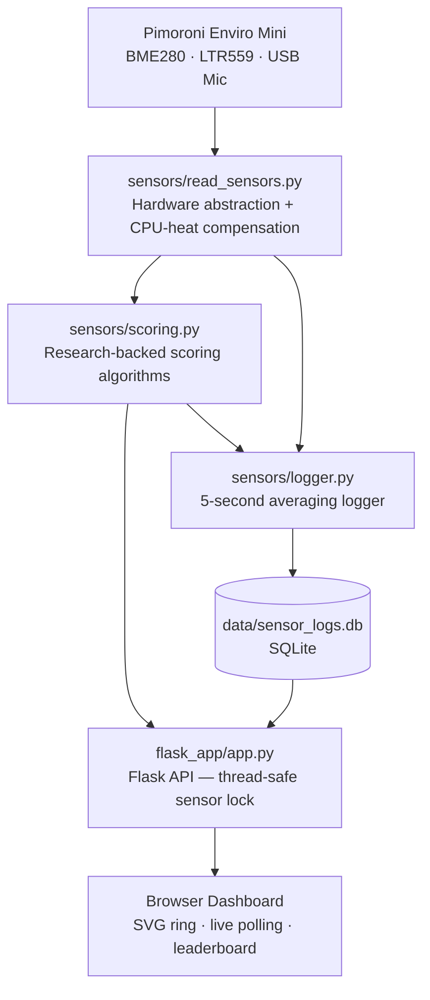

# Cognitive Comfort Index (CCI)


A real-time environmental monitoring system that scores how productive your surroundings are — built on a Raspberry Pi with the Pimoroni Enviro Mini. Every second, the system reads temperature, humidity, light, and noise, maps them through research-backed scoring models, and reports a 0–100 **Cognitive Comfort Index** on a live web dashboard. Study spots can be saved to a leaderboard to find and share the best places to work.

## Architecture



## Scoring Model

Each environmental factor is converted to a 0–100 score using a peer-reviewed model. The CCI is an equal-weighted composite:

> **CCI = 0.25 × (Temperature + Light + Humidity + Noise)**

| Factor | Model | Source |
|---|---|---|
| **Temperature** | Cubic polynomial fit of task performance vs. °C | [Seppanen et al., 2006 — LBNL](https://indoor.lbl.gov/publications/effect-temperature-task-performance) |
| **Light** | Logarithmic approach-to-optimal at 500 lux | [Veitch & Newsham, 1998](https://www.sciencedirect.com/science/article/abs/pii/S0272494413001060); [Eklund, 2000](https://journals.sagepub.com/doi/10.1177/096032719002200201) |
| **Humidity** | Quadratic penalty centered at 45 % RH | [Sterling et al., 1985 — ASHRAE](https://pubmed.ncbi.nlm.nih.gov/15330775/) |
| **Noise** | Piecewise linear, physiological optimum at 50 dBA | [Srinivasan et al., 2023 — npj Digital Medicine](https://www.springernature.com/gp/open-science/about/the-fundamentals-of-open-access-and-open-research) |

All coefficients live in [`sensors/config.py`](sensors/config.py) with calibration guidance, so they can be tuned against reference instruments without touching the scoring logic.

## Features

- Real-time sensor readings updated every second
- CPU-heat-compensated temperature for accurate BME280 readings
- Research-informed scoring with documented academic citations
- Flask web dashboard with SVG progress ring and color-coded scores
- Study spot leaderboard backed by SQLite
- Exponential backoff polling with visible connection-loss indicator
- Mock sensor mode for running on any machine without Pi hardware

## Project Structure

```
csci4900Proj/
├── sensors/
│   ├── config.py           # All calibration constants and model coefficients
│   ├── read_sensors.py     # Hardware abstraction — lazy init, None-safe returns
│   ├── scoring.py          # Pure scoring functions with research citations
│   └── logger.py           # 5-second averaging logger → SQLite
├── flask_app/
│   ├── app.py              # Flask routes, thread-safe sensor lock, input validation
│   ├── templates/
│   │   └── index.html      # Dashboard — responsive grid, error banner, ARIA labels
│   └── static/
│       ├── css/style.css   # Styling, responsive breakpoints, skeleton loader
│       └── js/main.js      # Backoff polling, leaderboard, XSS-safe rendering
├── tests/
│   ├── test_scoring.py     # 27 unit tests for scoring functions (no hardware)
│   └── test_app.py         # 10 Flask route tests with mocked sensors
├── scripts/
│   └── setup_rpi.sh        # Automated Raspberry Pi setup
├── data/
│   └── sensor_logs.db      # SQLite database (auto-created on first run)
├── pyproject.toml          # pytest configuration
├── requirements.txt        # Runtime dependencies
└── requirements-dev.txt    # Development dependencies (pytest)
```

## Prerequisites

### Hardware
- Raspberry Pi (tested on Pi 4)
- Pimoroni Enviro Mini HAT
- MicroSD card and power supply
- Wi-Fi connection

### Software
- Python 3.9 or later
- Flask
- Pimoroni Enviro+ libraries (`bme280`, `ltr559`)

## Installation and Setup (Raspberry Pi)

1. Clone the repository:
```bash
git clone https://github.com/adub48/csci4900Proj
cd csci4900Proj
```

2. Run the automated setup script:
```bash
bash scripts/setup_rpi.sh
```
This updates APT, installs system packages (PortAudio, I2C tools, BLAS), enables I²C and SPI via `raspi-config`, creates a `.venv`, and installs Python dependencies.

3. Start the app:
```bash
./run.sh
```

4. Open a browser on any device on the same network:
```
http://<your_pi_ip>:5000
```

### Manual setup (alternative to the script)

1. Enable I²C and SPI via `raspi-config`.
2. Install system packages:
```bash
sudo apt-get update
sudo apt-get install -y \
    python3-venv python3-dev build-essential \
    libatlas-base-dev libopenblas-dev \
    libportaudio2 portaudio19-dev \
    i2c-tools python3-smbus
```
3. Create a virtualenv and install dependencies:
```bash
python3 -m venv .venv
source .venv/bin/activate
pip install --upgrade pip setuptools wheel
pip install -r requirements-rpi.txt
```

## Running Without Hardware (Development Mode)

Set `MOCK_SENSORS=1` to serve plausible fixed readings without any Pi hardware attached. Useful for UI development and demos on a laptop:

```bash
MOCK_SENSORS=1 python flask_app/app.py
```

The dashboard loads normally and polls the mock data at the standard 1-second rate.

## Running Tests

Tests cover all scoring functions (pure Python, no hardware) and all Flask routes (sensors mocked):

```bash
pip install -r requirements-dev.txt
pytest tests/ -v
```

## Future Improvements

- Integration of full Enviro+ HAT for particulate and air-quality sensing
- Historical data visualizations and trend charts
- Improved noise smoothing with a longer sample window
- Machine learning–based scoring enhancements

## License

Developed for academic and educational purposes. Fork, modify, and extend freely.

## Acknowledgments

- CSCI 4900
- Pimoroni Enviro hardware and open-source libraries
